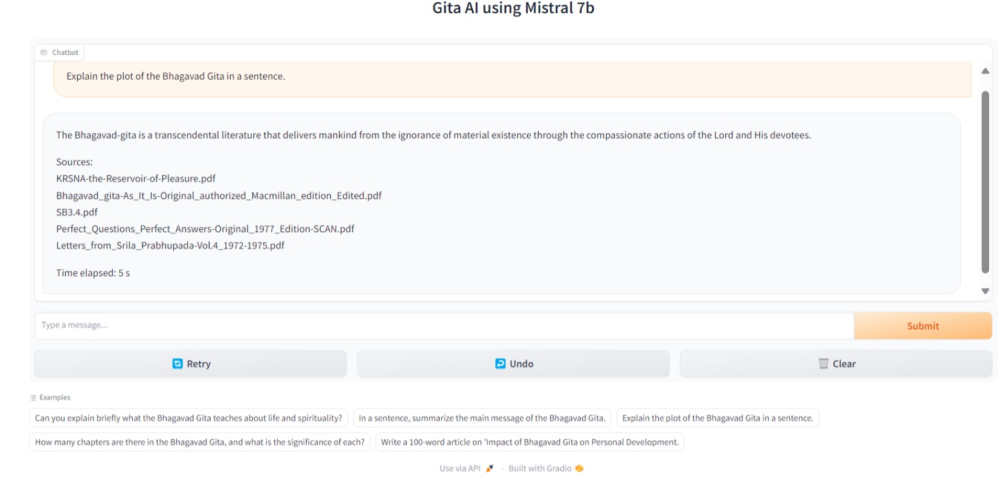
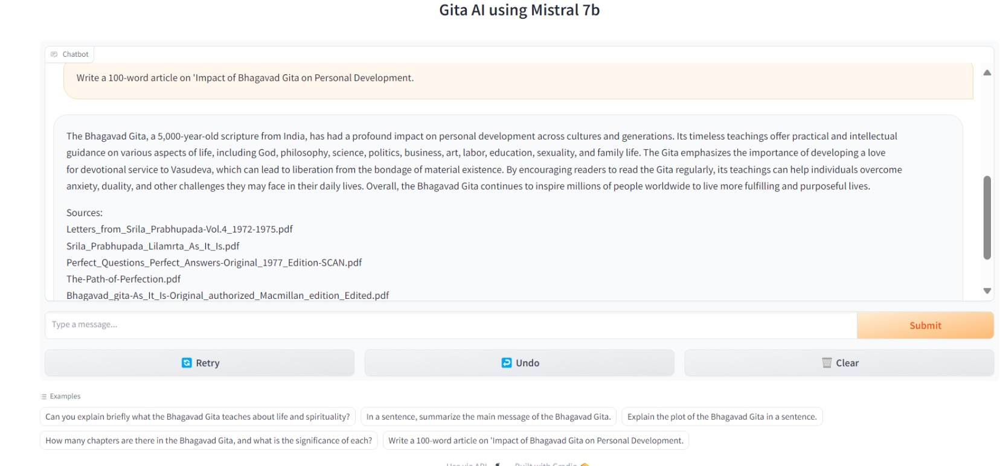

# Mistral7b-Bhagavad-Gita-RAG-AI-Bot

🐣 Please follow me for new updates https://github.com/shrimantasatpati  

# 🚦 WIP 🚦
Deployments coming soon!

### Technology Stack
1. [FAISS](https://engineering.fb.com/2017/03/29/data-infrastructure/faiss-a-library-for-efficient-similarity-search/) - Vector database
2. Google Colab - Development/ Inference using T4 GPU
3. [Gradio](https://www.gradio.app/) - Web UI, inference using free-tier Colab T4 GPU
4. [HuggingFace](https://huggingface.co/) - Transformer, Sentence transformers (for creating vector embeddings), Mistral7b quantized model
5. [LangChain](https://www.langchain.com/) - Retrieval augmented generation (RAG) using RetrievalQA chain functionality 

## 🦒 Colab

| Colab | Info
| --- | --- |
 | Creating FAISS vector database from Kaggle dataset
 | Mistral7b (4bit) RAG Inference of Bhagavad Gita using Gradio

- Store the vector database in your Google Drive in the following format "vectorstore/db_faiss". The db_faiss contains the following: index.faiss and index.pkl.
- Mount the Google Drive to load the vector embeddings for inference. [Mistral7b (4bit) RAG Inference of Bhagavad Gita using Gradio](https://github.com/shrimantasatpati/Mistral7b-Bhagavad-Gita-RAG-AI-Bot/blob/main/Mistral7b_Inference_RAG_Bhagavad_Gita.ipynb)
- Using BitandBytes configurations (load_in_4bit) for quantization - A bit loss in precision, but performance is almost at par with the Mistral7b (base) model.
- HuggingFace pipeline for "text-generation".
- AutoTokenizer and AutoModelforCasualLM from "transformers" for tokenization and loading [Mistral7b](https://huggingface.co/mistralai/Mistral-7B-Instruct-v0.1) model from HuggingFace Spaces.

### Dataset
- See - [Kaggle Dataset](https://www.kaggle.com/datasets/shrimantasatpati/bhagavad-gita-english)
- 150 books, 37486 pages are there.

### FAISS vector embeddings
- Using sentence-transformers/all-MiniLM-L6-V2 from [Huggingface](https://huggingface.co/sentence-transformers/all-MiniLM-L6-v2)
- Vector database - [Google Drive](https://drive.google.com/drive/folders/1SVZEN9426k0MPibo4CjhbBcG1ZRa-Oo1?usp=drive_link)

## Main Repo
https://github.com/mistralai/mistral-src  

## Paper/ Website
- https://mistral.ai/news/announcing-mistral-7b/  
- https://arxiv.org/abs/2212.04356  
- https://mistral.ai/

## Output

